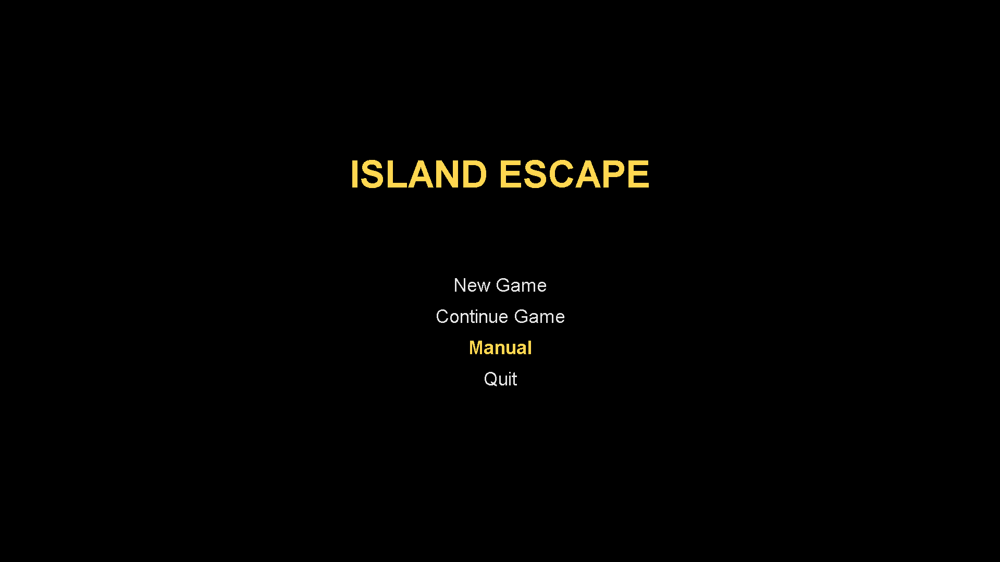
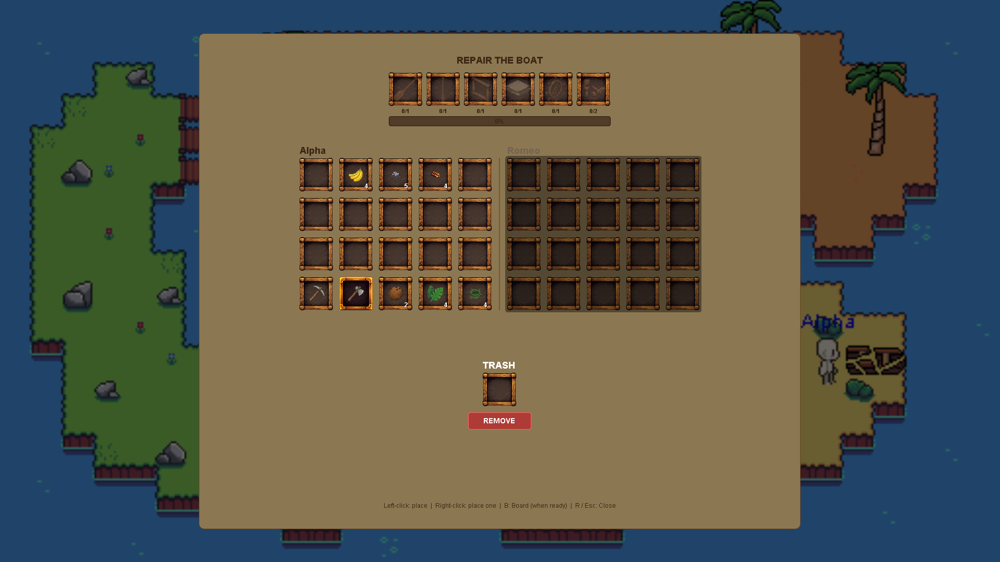
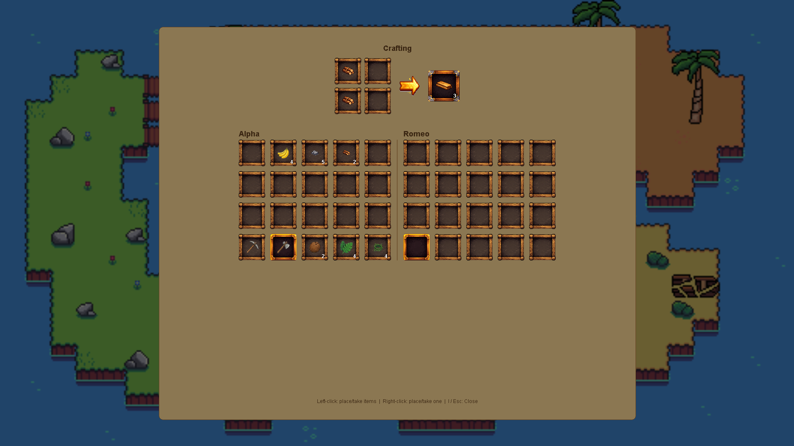
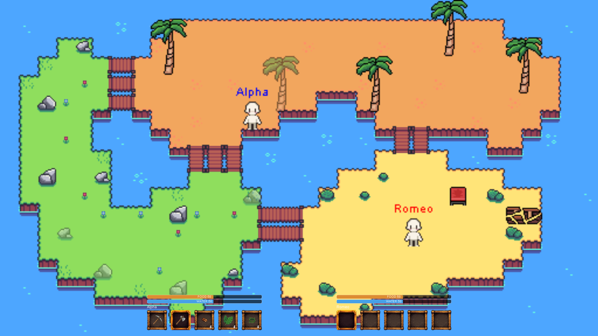
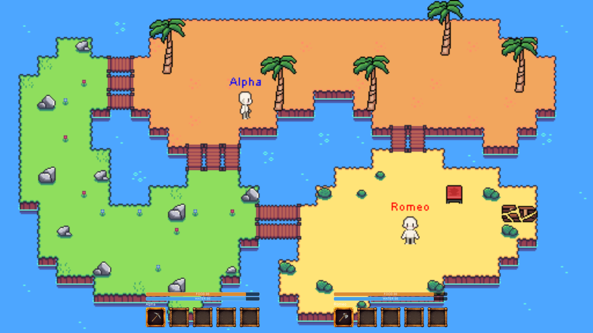

# Island Escape

A local 2-player co-op survival game built in Java with Swing. The game shows the island where players must gather resources, keep hunger and thirst in check, craft tools and boat parts, repair the wrecked boat, and board it together in order to escape.

## Gameplay

- **Survive:** Hunger and thirst drain continuously. Low stats slow you down. Running out of both for too long ends the game.
- **Gather:** Chop trees and mine stone around the island using the right tool for each resource.
- **Craft:** Combine gathered resources at the crafting table to make rope, tools and boat parts.
- **Repair:** Put the parts in the boat wreck to repair it.
- **Escape:** When the boat is fully repaired, both players can board on it together to win.

The game is played by two people sharing one keyboard.

## Controls

| Action | Player 1 | Player 2 |
|---|---|---|
| Move | `W` `A` `S` `D` | Arrow keys |
| Action / place item | `E` (also opens inventory) | `Space` |
| Gather nearby resource | `G` | `M` |
| Eat / drink first consumable | `F` | `.` |
| Hotbar slot select | `1`–`5` | `6` `7` `8` `9` `0` |

Shared:

| Action | Key |
|---|---|
| Open crafting screen (near table) | `I` |
| Confirm craft | `Enter` |
| Open boat repair screen (near wreck) | `R` |
| Board the boat (once fully repaired) | `B` |
| Save game | `F5` |
| Close panel / back to main menu | `Esc` |

An in-game manual accessible from the main menu and shows the full control and
recipe reference.

## Crafting recipes

| Item | Ingredients |
|---|---|
| Rope | 2 Vines |
| Axe | 1 Stone + 1 Wood + 1 Rope |
| Pickaxe | 2 Stone + 1 Wood + 1 Rope |
| Plank ×3 | 2 Wood |
| Paddle | 2 Plank |
| Frame | 2 Plank + 2 Rope |
| Mast | 3 Wood + 1 Rope |
| Rudder | 2 Plank + 1 Stone + 1 Rope |
| Fittings | 2 Wood + 1 Stone + 1 Rope |
| Sail | 2 Tropical Leaves + 1 Wood + 1 Rope |

**Boat repair slots:** 3 Plank, 1 Mast, 1 Frame, 1 Sail, 1 Rudder, 2 Fittings.

## Tech stack

- **Java 25**, using Swing/AWT for windowing, rendering, and input - no game
  engine or external runtime dependencies.
- **Tiled** (`.tmx`/`.tsx`) map format for the island layout built in TileMap, parsed and
  rendered by a custom `map` package (`MapLoader`, `TileMap`, `MapRenderer`).
- **JUnit 4** and **JUnit 5** for tests (added as IDE-managed libraries).

## Project structure

```
src/java/com/islandescape/
  Main.java          entry point — wires up map, players, systems, window
  audio/             sound loading & playback
  boat/              boat wreck + repair system
  crafting/          crafting recipes and crafting system
  input/             keyboard and mouse handlers
  inventory/         inventory, cursor, trash bin, inventory screen
  item/              item types, categories, consumables
  map/               Tiled map loading, tile layers, tilesets, rendering
  player/            player state, sprite, facing, survival stats
  resources/         gatherable resource nodes (trees, stone) + spawner
  save/              save/load (Properties-file based save format)
  structures/         placeable world structures (crafting table, fireplace,
                      chest, boat wreck neighbors, etc.)
  ui/                screens & overlays (main menu, manual, crafting,
                      boat repair, win/game-over, HUD)
  utilities/         shared helpers (Direction)
  window/            game window, game panel (render/update loop), game state

src/resources/       sprites, tilesets, Tiled maps, sound files
src/test/java/       JUnit test suite mirroring the main package structure
                     (58 test files covering inventory, crafting, boat
                     repair, survival stats, map/collision, save/load, etc.)
```

## Running the game

This is a plain Java module with no external runtime dependencies.

**IntelliJ IDEA (recommended):**
1. Open the project folder in IntelliJ IDEA.
2. Let it index — the project JDK (25) is already configured.
3. Run `Main.java` (`src/java/com/islandescape/Main.java`) with the working
   directory set to the project root (assets are loaded via paths relative
   to `src/resources/...`, not the classpath).

**Command line:**
```bash
# from the repository root
javac -d out $(find src/java -name "*.java")
java -cp out com.islandescape.Main
```

## Running tests

Tests use JUnit 5. Run them from
IntelliJ IDEA's built-in test runner.

## Known limitations

- No packaged/runnable file created.
- No gameplay video yet.
- Saving supports a single save slot (`save.txt`) via `F5`.

## Gameplay screenshots

<table>
  <tr>
    <td align="center"><br><sub>Main menu</sub></td>
    <td align="center"><br><sub>Boat repair screen</sub></td>
  </tr>
  <tr>
    <td align="center"><br><sub>Crafting screen</sub></td>
    <td align="center"><br><sub>Exploring the island</sub></td>
  </tr>
  <tr>
    <td align="center"><br><sub>Exploring the island</sub></td>
    <td></td>
  </tr>
</table>
